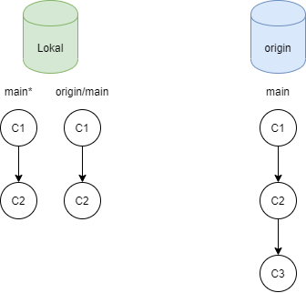

# Git cmds

## :pencil2: Init
Ein leeres Git-Repository erstellen oder ein bestehendes neuinitialisieren

```bash
git init 
```

## :incoming_envelope: Clone 
Ein Repository in einem neuen Verzeichnis klonen.

```bash
git clone 
```

### Wichtige Flags
```bash
-b <name>, --branch <name>
           Instead of pointing the newly created HEAD to the branch pointed to by the cloned repository's HEAD, point to <name> branch instead. In a
           non-bare repository, this is the branch that will be checked out.  --branch can also take tags and detaches the HEAD at that commit in the
           resulting repository.

<directory>
            The name of a new directory to clone into.         
```

### Beispiel 
```bash
git clone git://git.kernel.org/pub/scm/.../linux.git my-linux
cd my-linux
```
Kopiert von der Quelle "git://git.kernel.org/pub/scm/.../linux.git" das Repository und legt es im neuen Ordner "my-linux" ab.

## :arrow_heading_up: Branch
Branches anzeigen, erstellen oder entfernen.

```bash
git branch 
```

### Wichtige Flags
```bash
-d, --delete
           Delete a branch. The branch must be fully merged in its upstream branch, or in HEAD if no upstream was set with --track or --set-upstream-to.

-D
           Shortcut for --delete --force.

-a, --all
           List both remote-tracking branches and local branches. Combine with --list to match optional pattern(s).

-l, --list
           List branches. With optional <pattern>..., e.g.  git branch --list 'maint-*', list only the branches that match the pattern(s).

--show-current
           Print the name of the current branch. In detached HEAD state, nothing is printed.

<branchname>
           The name of the branch to create or delete. The new branch name must pass all checks defined by git-check-ref-format(1). Some of these checks may
           restrict the characters allowed in a branch name.
```

### Beispiel 
```bash
git branch my2.6.14    (1)
git branch -d my2.6.13 (2)
```
(1) Erstellt ein neuen Branch mit dem Namen "my2.6.14". \
(2) Löscht den Branch mit dem Namen "my2.6.13"

## :twisted_rightwards_arrows: Switch
Branches wechseln.

```bash
git switch 
```

### Wichtige Flags
```bash
-c <new-branch>, --create <new-branch>
           Create a new branch named <new-branch> starting at <start-point> before switching to the branch. This is a convenient shortcut for:

               $ git branch <new-branch>
               $ git switch <new-branch>
<branch>
           Branch to switch to.              
```

### Beispiel 
```bash
git switch my2.6.14
```
Wechselt das aktuelle lokale Verzeichnis zu dem Branch "my2.6.14"  

## :information_source: Status
Den Zustand des Arbeitsverzeichnisses anzeigen.

```bash
git status 
```

## :inbox_tray: Fetch
Objekte und Referenzen von einem anderen Repository herunterladen.

```bash
git fetch 
```

## :inbox_tray: Pull
Objekte von einem externen Repository anfordern und sie mit einem anderen Repository oder einem lokalen Branch zusammenführen.

```bash
git pull 
```
## Unterschied zwischen Pull und Fetch
Da der Unterschied zwischen Pull und Fetch nicht sofort ersichtlich ist erfolgt an dieser Stelle eine detaillierte Beschreibung.

Die Ausgangssituation ist in der unteren Abbildung dargestellt. Das Remote-Repository, auch als "Origin" bezeichnet, besitzt einen `main` Branch mit Commit 1-3. Es ist unserem Lokalen repository also einen Commit voraus. 

Lokal verwaltet GitHub zwei Branches. Den schon bekannten `main` Branch auf dem sich ganz normal Arbeiten lässt und einen `origin/main` Branch der den letzten **bekannten** Zustand des Remote-Repositories anzeigt. 


:information_source: Um alle Branches anzuzeigen kann der befehl `git branch -a` verwendet werden.




### git fetch
Wird der Befehl `git fetch` ausgeführt, werden alle `origin\...` branches aktualisiert. Der `main` Branch auf den aktuell gearbeitet wird bleibt davon unberührt.


Mit dem Befehl `git merge origin/main` kann der aktualisierte Branch `origin/main` dann in den ausgechekten main Branch gemerged werden.

### git pull
Der Befehl `git pull` ist eine kombination aus `git fetch` und `git merge origin/main`. Die remote Branches werden aktuallisiert und die Änderungen sofort in den `main` Branch gemerged.


:information_source: Weitere Informationen und interaktive Aufgaben finden sich auf: [LearnGitBranching]https://www.youtube.com/watch?v=dQw4w9WgXcQ


## :white_check_mark: Add 
Dateiinhalte zum Commit vormerken.

```bash
git add 
```

### Wichtige Flags
```bash
<pathspec>...
           Files to add content from. Fileglobs (e.g.  *.c) can be given to add all matching files. Also a leading directory name (e.g.  dir to add dir/file1 and dir/file2) can
           be given to update the index to match the current state of the directory as a whole (e.g. specifying dir will record not just a file dir/file1 modified in the working
           tree, a file dir/file2 added to the working tree, but also a file dir/file3 removed from the working tree). Note that older versions of Git used to ignore removed
           files; use --no-all option if you want to add modified or new files but ignore removed ones.

           For more details about the <pathspec> syntax, see the pathspec entry in gitglossary(7).
-f, --force
           Allow adding otherwise ignored files.

-A, --all, --no-ignore-removal
           Update the index not only where the working tree has a file matching <pathspec> but also where the index already has an entry. This adds, modifies, and removes index
           entries to match the working tree.

           If no <pathspec> is given when -A option is used, all files in the entire working tree are updated (old versions of Git used to limit the update to the current
           directory and its subdirectories).
```
### Beispiel 
```bash
git add Documentation/\*.txt    (1)
git add -A                      (2)
```
(1) Fügt alle Dateien mit der Dateiendung `.txt` im Ordner `Documentation` hinzu. \
(2) Alle aktuellen Änderungen werden hinzugefügt. 

## :file_folder: Commit
Änderungen in das Repository eintragen.

```basch 
git commit
```
### Wichtige Flags
```bash
-a, --all
           Tell the command to automatically stage files that have been modified and deleted, but new files you have not told Git about are not affected.

-m <msg>, --message=<msg>
           Use the given <msg> as the commit message. If multiple -m options are given, their values are concatenated as separate paragraphs.

           The -m option is mutually exclusive with -c, -C, and -F.

--author=<author>
           Override the commit author. Specify an explicit author using the standard A U Thor <author@example.com> format. Otherwise <author> is assumed to be a pattern and is
           used to search for an existing commit by that author (i.e. rev-list --all -i --author=<author>); the commit author is then copied from the first such commit found.

--date=<date>
           Override the author date used in the commit.

```

### Beispiel 
```bash
git commit -a -m "better Markdown"  
```
Alle geänderten Dateien werden mit der Nachricht `better Markdown` commitet. 

## :outbox_tray: Push
Remote-Referenzen mitsamt den verbundenen Objekten aktualisieren.

```bach
git push
```

# :no_entry_sign: .gitignore 
Mit einem ".gitignore" File kann Git mitgeteilt werden welche Daten nicht syn­chro­ni­sie­rt werden. 
Dieser File mus im Hauptverzeichnis des Repository abgelegt werden.

### Muster
| Muster           | Bsp.                                                             | Beschreibung                                                                                          |
| ---------------- | ---------------------------------------------------------------- | ----------------------------------------------------------------------------------------------------- |
| `hello.txt`      | hello.txt <br /> *aber nicht* <br /> test/hallo.txt              | Genau eine Datei wird ignoriert                                                                       |
| `hello.*`        | hello.txt<br /> hello.cpp<br /> *aber nicht* <br />hello1.txt    | Alle Dateien mit dem gleichen Namen, werden ignoriert, dabei wird nicht auf die Dateiendung geachtet. |
| `**/logs`        | test/logs  <br /> test/foo/logs                                  | In allen Ordnern wird der genannte Ordner Ignoriert                                                   |
| `logs/**`        | logs/a.out <br /> logs/cpp/a.out                                 | Alles was in dem Ordner abgelegt ist wird ignoriert.                                                  |
| `*.log`          | test.log <br /> build/test2.log                                  | Alle Dateien mit der gleichen Dateiendung werden ignoriert.                                           |
| `debug[0-9].log` | debug0.log<br /> debug9.log<br /> *aber nicht* <br />debug10.log | Alle Dateien welche ins das Muster passen werden ignoriert                                            |
| `!logs/log1.log` |                                                                  | Der angegebene Pfad wird explizit Synchronisiert                                                      |

[git.com Git Dokumentation](https://git-scm.com/docs/gitignore)

### Beispiel für C/C++

```bash
# Build Ordner 
build/**

## Beispiel für C/C++
# Object files
*.o
*.ko
*.obj
*.elf

# Libraries
*.lib
*.a
*.la
*.lo

# CMake
CMakeLists.txt.user
CMakeCache.txt
CMakeFiles
CMakeScripts
Testing
Makefile
cmake_install.cmake
install_manifest.txt
compile_commands.json
CTestTestfile.cmake
_deps

# VisualStudioCode
.vscode/*
!.vscode/settings.json
!.vscode/tasks.json
!.vscode/launch.json
!.vscode/extensions.json
*.code-workspace

##### MacOS
# General
.DS_Store
.AppleDouble
.LSOverride

##### Windows
# Windows thumbnail cache files
Thumbs.db
Thumbs.db:encryptable
ehthumbs.db
ehthumbs_vista.db

# Dump file
*.stackdump

# Folder config file
[Dd]esktop.ini

# Recycle Bin used on file shares
$RECYCLE.BIN/

# Windows Installer files
*.cab
*.msi
*.msix
*.msm
*.msp

# Windows shortcuts
*.lnk

```

